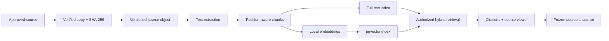

Kynolith Core

**Local-first, source-grounded intelligence and canon operations for the Kynolith ecosystem.**

Kynolith Core is a private operating environment for transforming manuscripts, reference material,
creative decisions, and captured ideas into traceable knowledge. It is designed around one rule:
important output must remain connected to the exact source version and citation that supports it.

> **Project status:** Active development. The archive, document retrieval, citation, and snapshot
> foundation is operational. Broader memory, drafting, collaboration, and production workflows are
> being developed in phases.

## Why Core exists

Creative worlds accumulate manuscripts, canon notes, business records, conversations, drafts, and
production artifacts across many tools. Conventional chat interfaces can generate useful text, but
they rarely provide durable provenance, enforceable privacy boundaries, or controlled canon
evolution.

Core provides the authoritative layer between source material and creative work:

- preserves original files while producing rebuildable search derivatives;
- versions sources and binds citations to exact positions;
- filters retrieval by classification before a query reaches private content;
- freezes source snapshots for repeatable, source-grounded work;
- keeps AI and embedding workflows local by default;
- records decisions, approvals, and provenance as first-class data.

## Operational today

- Local identity and role-based access foundation
- Read-only source boundary with verified, hash-matched imports
- PDF, DOCX, Markdown, and plain-text extraction
- Page, heading, paragraph, table-row, and character-position citation anchors
- Versioned sources, derivatives, chunks, and citations
- PostgreSQL full-text search
- Offline 384-dimensional embeddings stored and searched with pgvector
- Classification-first hybrid retrieval
- Immutable source snapshots with deterministic manifest hashes
- Authenticated extracted-source viewer with highlighted citations
- Structured audit events, migrations, backups, and health reporting
- Responsive SvelteKit web/PWA foundation

The current embedding provider is deterministic and network-free. The provider boundary is designed
to support stronger local transformer or Ollama-compatible embedding models without changing source
or citation identity.

## Architecture



| Layer | Technology | Responsibility |
|---|---|---|
| Web | SvelteKit, TypeScript | Local responsive workspace and source viewer |
| API | FastAPI, Python 3.12 | Identity, policy, ingestion, retrieval, snapshots, audit |
| Data | PostgreSQL, SQLAlchemy, Alembic | Authoritative records, versions, and migrations |
| Retrieval | PostgreSQL FTS, pgvector | Classification-scoped lexical and vector search |
| Documents | pypdf, python-docx | Deterministic extraction and position anchors |
| Operations | PowerShell, structured logs | Local startup, migration, backup, and recovery |

## Security model

Core is built as a local-first system, not a cloud document uploader.

- Services bind to loopback unless explicitly reconfigured.
- Source archives are treated as read-only inputs.
- Managed copies are verified with SHA-256 before processing.
- Retrieval is restricted before search results are assembled.
- Private classifications are never retrieved broadly and filtered afterward.
- Credentials and runtime data are excluded from source control.
- Cloud AI is disabled unless a future policy explicitly authorizes a provider and data class.
- Generated material is treated as a proposal until reviewed and approved.

Do not report security vulnerabilities through a public issue. Use the private security contact
published by Kynolith LLC when the external security policy becomes available.

## Repository structure

```text
Kynolith-Core/
├── config/                 # Safe defaults and policy definitions
├── docs/                   # Architecture, runbooks, and engineering contracts
├── scripts/                # Local operations and database tooling
├── server/
│   ├── core_api/           # FastAPI application and domain services
│   └── migrations/         # Alembic database migrations
├── tests/                  # Security, ingestion, retrieval, and migration tests
├── web/                    # SvelteKit web/PWA client
├── pyproject.toml
└── README.md
```

Runtime databases, imported material, credentials, backups, generated derivatives, and private
archives are intentionally absent from the repository.

## Development setup

### Requirements

- Python 3.12
- Node.js 24 and pnpm
- PostgreSQL 18 with pgvector
- Windows PowerShell for the current local operations scripts

### Backend

```powershell
python -m venv .venv
.\.venv\Scripts\Activate.ps1
python -m pip install --upgrade pip
python -m pip install -e ".[dev]"
Copy-Item .env.example .env.local
```

Configure local database credentials in the ignored `.env.local`, enable pgvector in the target
database, and apply migrations:

```sql
CREATE EXTENSION IF NOT EXISTS vector;
```

```powershell
python -m alembic upgrade head
python -m uvicorn core_api.main:app --host 127.0.0.1 --port 8010
```

### Web client

```powershell
Set-Location web
pnpm install --frozen-lockfile
pnpm check
pnpm build
```

### Verification

```powershell
.\.venv\Scripts\ruff.exe format --check server tests
.\.venv\Scripts\ruff.exe check server tests
.\.venv\Scripts\pytest.exe
```

## Roadmap

- **Phase 0:** Identity, persistence, audit, backups, and archive firewall
- **Phase 1:** Document ingestion, citations, hybrid retrieval, viewer, and snapshots
- **Phase 2:** Dragon's Ear capture and the Legacy/Lore/Logic Crystal Engine
- **Phase 3:** Chronology, ritual workflows, and the Crystal Room
- **Phase 4:** Source-grounded drafting, canon review, and approvals
- **Phase 5:** Council and role-based collaboration workflows
- **Phase 6:** Isolated public/member-safe knowledge projection
- **Phase 7:** Versioned production exchange with Forge Studio
- **Phase 8:** Explicitly configured secure remote operation

## Relationship to Forge Studio

Core owns knowledge, provenance, classifications, canon decisions, approvals, and source snapshots.
[Forge Studio](https://github.com/DawGroomer/Forge-Studio) owns production planning, DCC execution,
assets, scenes, shots, renders, and production results.

The applications remain independently operable and communicate through versioned production brief
and result packages. Neither application receives unrestricted access to the other's storage.

## Contributing

The supported implementation is currently developed privately by Kynolith LLC. Public issues and
contributions will open after the external API, security policy, fixture set, and contributor
license process are ready.

Until then, this README documents the product direction without publishing private manuscripts,
credentials, production assets, internal prompts, or proprietary canon.

## License

Copyright © Kynolith LLC. All rights reserved.

No open-source license is granted unless a `LICENSE` file is added to the public repository.
